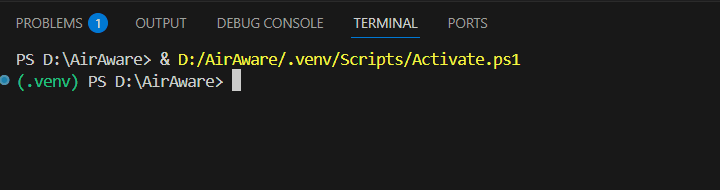
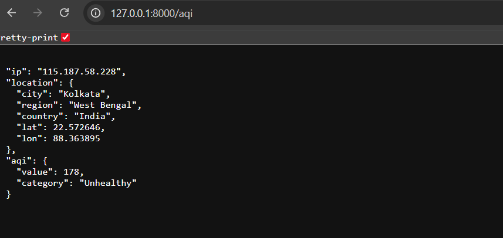

# AirAware
This project is an assignment given by InfinityBit for the second round of the interview.

## Important Note (Regarding Front-end Implementation)
>[!NOTE]
>The project has front-end at [this link.](https://github.com/DeepSingha420/AirAware_UI/tree/main)  
>It is a request to visit the front-end repo, as **this link of front-end repo contains the required implementation of "Timeout Handling" and "Caching Strategy."**

---

## The ready-made app is available
1. Front-end *or* User-friendly Interface : https://air-aware.streamlit.app/ [More details at [this link.](https://github.com/DeepSingha420/AirAware_UI/tree/main) ]
2. Back-end *or* JSON data : https://air-aware-three.vercel.app/aqi

---

## Instructions for localhost

### Step 1 : Clone The Repo
```bash
git clone https://github.com/DeepSingha420/AirAware
cd AirAware
```

### Step 2 : Install The Required Dependencies
```bash
pip install -r requirements.txt
```

### Step 3. Setup And Run The Local Server
```bash
uvicorn main:app --reload
```


### Step 4 : Execute AirAware Through 127.0.0.1
Go to any browser and execute the uvicorn server url : http://127.0.0.1:8000/aqi


**JSON Output In The Browser :**


---

## Design Choices
### Reason for choosing ipwho.is and Open-Meteo
- No API Key Required
- Seamless integration with Python
- Globally distributed servers help measure IP region and AQI precisely
- Open Source

### Timeout Handling
Vercel maintain a strict 10s execution limit. This helps the final product handle the "Timeout" of API execution seamlessly.

### Handling of Private/Local IP Addresses
This project uses `ipify.org` to easily get the network ip of the localhost, instead of returning the localhost ip (127.0.0.1).

### Caching Handling
The frontend uses `@st.cache_resource(ttl)` for handling caching of the retrieved data for the limit amount of TTL. This helps next execution run instantly, without any buffer (fetching, processing).

---

## Folder Structure
```text
AirAware/
 ├── main.py
 ├── routers/
 │    └── aqi.py
 ├── services/
 │    ├── ip_service.py
 │    ├── geo_service.py
 │    └── aqi_service.py
 ├── models/
 │    └── schemas.py
 ├── requirements.txt
 ├── LICENSE
 └── README.md
```
